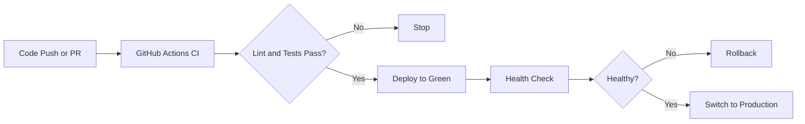
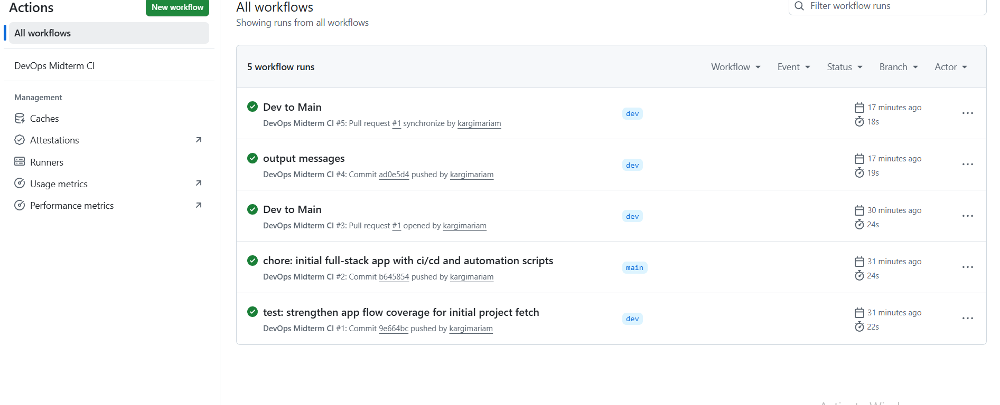

# DevOps Midterm Project

This project is a small full-stack web application that demonstrates core DevOps practices: version control, CI, environment automation, blue-green deployment, rollback, and monitoring.

## Tech Stack
- Frontend: React + TypeScript
- Backend: Node.js + Express
- Testing: Vitest + React Testing Library
- CI: GitHub Actions
- Automation/IaC: Shell scripts (`setup.sh`, `deploy.sh`, `rollback.sh`, `monitor.sh`)

## CI/CD Workflow Diagram



## Web Application Requirements Mapping
- Dynamic route: `GET /api/projects/:id`
- Input endpoint: `POST /api/projects`
- Automated unit tests: `src/App.test.tsx`

## Step-by-Step Instructions

### Windows command notes
On this project in Windows PowerShell:
- Setup: `./setup.sh`
- Deploy: `sh deploy.sh`
- Rollback: `sh rollback.sh`
- Monitor: `sh monitor.sh`

### 1) Environment setup (IaC)
Run:

```bash
./setup.sh
```

This command installs dependencies, creates required directories, generates `.env`, and builds the project.

Screenshot (successful IaC execution):


### 2) Run the application
Run:

```bash
npm run dev
```

Screenshot (running application):


### 3) Run tests
Run:

```bash
npm run test
```

Screenshot (tests passed):


### 4) Continuous Integration (CI)
CI is configured in `.github/workflows/ci.yml`.

Pipeline behavior:
- Triggers on push to `main` and `dev`
- Triggers on pull request to `main` and `dev`
- Runs linting and unit tests

Screenshot (successful CI pipeline):


### 5) Deployment (Blue-Green simulation)
Run:

```bash
sh deploy.sh
```

This script prepares a green environment, performs a health-check stage, and switches production to the new version.

Screenshot (deployment process):


### 6) Rollback
Run:

```bash
sh rollback.sh
```

This restores the previous version from the rollback backup.

### 7) Monitoring and health check
Run:

```bash
sh monitor.sh
```

The script checks `http://localhost:3000/api/health` periodically and writes results to `health-check.log`.

Screenshot (monitoring log results):


## Version Control Evidence
- Active branches used: `main` and `dev`
- Changes were committed with descriptive commit messages

Screenshot (branches):

