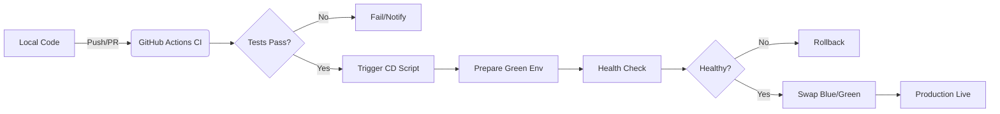

#  DevOps Midterm: Full-Stack Project Hub

This repository contains a full-stack project management application with integrated DevOps practices, including Continuous Integration (CI), Continuous Deployment (CD) with Blue-Green strategy, and Infrastructure as Code (IaC) automation.

## Tech Stack
- **Frontend**: React (TypeScript), Tailwind CSS, Lucide Icons, Framer Motion
- **Backend**: Node.js, Express.js
- **Testing**: Vitest, React Testing Library
- **DevOps/CI/CD**: GitHub Actions, Bash Shell Scripting
- **IaC**: custom shell-based automation (`setup.sh`)

---

##  CI/CD Workflow Diagram



---

##  Step-by-Step Setup & Deployment

### Windows shell notes
If you are using PowerShell on Windows, run shell scripts through `sh` unless otherwise noted.
- Setup: `./setup.sh` (this script is PowerShell-compatible in this repo)
- Deploy: `sh deploy.sh`
- Rollback: `sh rollback.sh`
- Monitor: `sh monitor.sh`

### 1. Environment Preparation (IaC)
To prepare your machine and install all necessary dependencies, run the automated setup script. This handles directory creation and environment config.
```bash
chmod +x *.sh
./setup.sh
```
*(Insert Screenshot: Successful IaC execution showing 'Environment Ready!')*

### 2. Running Local Development
Start the full-stack server (Vite + Express):
```bash
npm run dev
```

### 3. Continuous Integration (CI)
Our pipeline is configured in `.github/workflows/ci.yml`. It runs automatically on every Push.
- **Linting**: Checks code quality.
- **Testing**: Runs 4 automated unit tests.
- **Verification**: open a Pull Request from `dev` to `main` and confirm all checks pass in GitHub Actions.
*(Insert Screenshot: Successful CI pipeline run in GitHub Actions tabs)*

### 4. Deployment & Blue-Green Simulation
To deploy the application using the Blue-Green strategy:
```bash
./deploy.sh
```
This script creates a production symlink. If you encounter issues, you can revert instantly:
```bash
./rollback.sh
```
*(Insert Screenshot: Deployment process logs and the running app)*

### 5. Monitoring & Health Check
A dedicated monitoring service checks the `/api/health` endpoint every minute.
```bash
./monitor.sh &
```
View the results in the log file:
```bash
tail -f health-check.log
```
*(Insert Screenshot: Monitoring logs showing successful health checks)*

---

## Deliverables Checklist
- Web App with Dynamic Routes & Forms
- 4+ Automated Unit Tests
- Environment Preparation Script (IaC)
- GitHub Actions CI Pipeline
- Blue-Green Deployment Script
- Rollback Mechanism
- Real-time Health Monitoring Script
